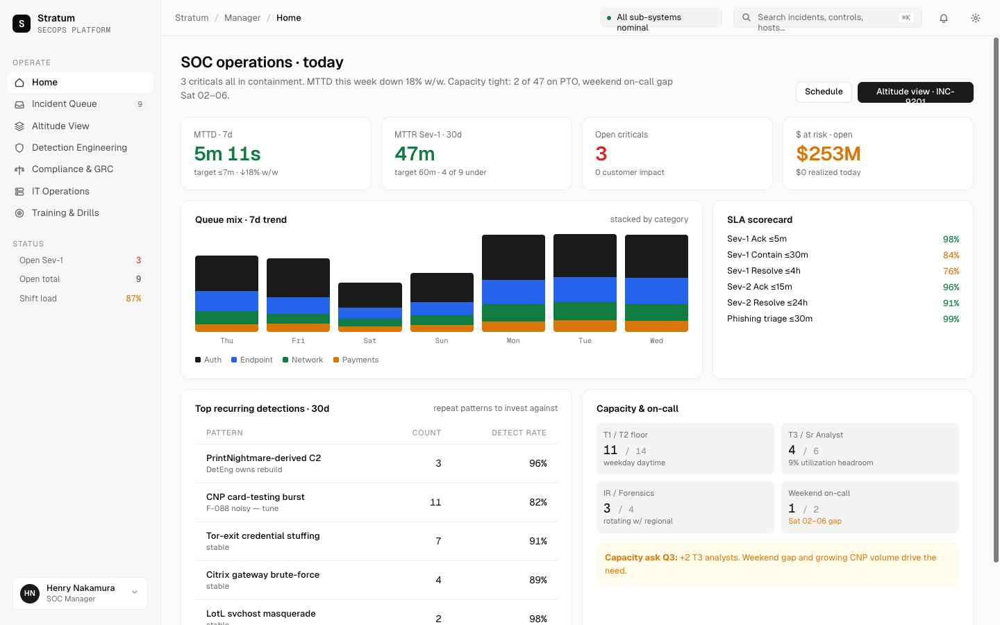

# CyberSec

A collection of cybersecurity tools and simulations built for learning, interview prep, and role-based training.

---

## Projects

### [SOC-Simulator — Stratum SecOps](./SOC-Simulator/README.md)

An interactive, single-file Security Operations Center platform that simulates a real enterprise SOC across the full organizational hierarchy — from a Tier 1 analyst triaging alerts to a CEO receiving an audit briefing. The signature Altitude View renders a single incident simultaneously from every role in the org chart, so you can see exactly how the narrative changes as it escalates up the chain.

**Quick start:** Open `SOC-Simulator/Stratum SecOps.html` in any modern browser.



---

### [Topicgen — Cybersecurity Topic Generator](./Topicgen/README.md)

A topic-card generator for red team and blue team study sessions. Draws from a curated library of MITRE ATT&CK-mapped offensive and defensive topics, surfacing them one at a time with difficulty ratings, descriptions, and save/history functionality.

**Quick start:** Open `Topicgen` in any modern browser.

---

## Repository Structure

```
CyberSec/
├── README.md                   ← You are here
├── SOC-Simulator/
│   ├── README.md               ← Full simulator documentation
│   ├── Stratum SecOps.html     ← Entry point — open this in a browser
│   ├── styles.css              ← Design system (CSS custom properties, themes)
│   ├── tweaks-panel.jsx        ← Live customization panel (theme, density, brand)
│   ├── screenshots/            ← UI screenshots for documentation
│   └── src/
│       ├── data.js             ← All shared data: roles, incidents, detections, controls
│       ├── app.jsx             ← Root app, routing, and global state
│       ├── shell.jsx           ← Sidebar, topbar, and role switcher
│       ├── home.jsx            ← Role-specific home dashboards (all 7 altitudes)
│       ├── queue.jsx           ← Incident queue and incident detail view
│       ├── altitude.jsx        ← Altitude View (signature feature)
│       ├── pages.jsx           ← Detection, Compliance, IT Ops, Training, Reports
│       ├── primitives.jsx      ← Shared UI components (chips, charts, cards)
│       └── icons.jsx           ← Stroke-based SVG icon set
└── Topicgen                    ← Self-contained topic generator (single HTML file)
```

---

## Architecture Overview

Both tools are **single-file or flat-file web applications** — no npm, no webpack, no server. React and Babel are loaded from CDN with SRI integrity hashes. All application state lives in memory; there is no database, no auth, and no network calls at runtime.

```
┌─────────────────────────────────────────────────────────────────┐
│                         Browser (no server)                      │
│                                                                  │
│  ┌──────────────────────────────────────────────────────────┐   │
│  │                  Stratum SecOps.html                      │   │
│  │  ┌────────────┐  ┌──────────────────────────────────┐   │   │
│  │  │  CDN libs  │  │         src/ modules (JSX)        │   │   │
│  │  │ React 18   │  │  app.jsx ──► shell.jsx            │   │   │
│  │  │ Babel      │  │      │      home.jsx              │   │   │
│  │  └────────────┘  │      │      queue.jsx             │   │   │
│  │                  │      │      altitude.jsx  ◄── ─── ┼── ── Signature feature
│  │  ┌────────────┐  │      │      pages.jsx             │   │   │
│  │  │  data.js   │  │      │      primitives.jsx        │   │   │
│  │  │ ROLES      │  │      └──────────────              │   │   │
│  │  │ INCIDENTS  │◄─┼── window globals (shared state)   │   │   │
│  │  │ DETECTIONS │  │                                    │   │   │
│  │  │ CONTROLS   │  └──────────────────────────────────┘   │   │
│  │  └────────────┘                                          │   │
│  │  styles.css ──► CSS custom properties (theme / density)  │   │
│  │  tweaks-panel.jsx ──► runtime overrides (brand / color)  │   │
│  └──────────────────────────────────────────────────────────┘   │
│                                                                  │
│  ┌──────────────────────────────────────────────────────────┐   │
│  │                      Topicgen                             │   │
│  │  Self-contained HTML · In-memory topic database           │   │
│  │  MITRE ATT&CK–mapped offensive + defensive topic cards    │   │
│  └──────────────────────────────────────────────────────────┘   │
└─────────────────────────────────────────────────────────────────┘
```

**Data flow in Stratum SecOps:**

1. `data.js` loads first and populates `window` globals (`ROLES`, `INCIDENTS`, `ALTITUDE_VIEWS`, etc.).
2. Babel transpiles all `.jsx` files in-browser at load time.
3. `app.jsx` initializes the React root, reads role/page state, and renders the shell.
4. `shell.jsx` derives the sidebar nav from `NAV_BY_ALTITUDE[role.altitude]` — the same page list filters automatically when you switch roles.
5. Page components (`home.jsx`, `queue.jsx`, `altitude.jsx`, etc.) receive `role` as a prop and render altitude-appropriate content from the shared data layer.

---

## Purpose

This repo exists to build and sharpen practical cybersecurity skills through simulation, tooling, and structured practice. Each project targets a specific gap — whether that's understanding how a SOC manager interprets risk, how detections move through an engineering pipeline, or how incidents are translated into executive briefings.

---

## License

MIT — use it for training, demos, interview prep, or fork it to build your own org's simulator.
