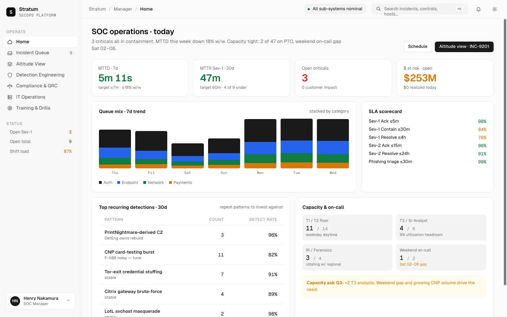
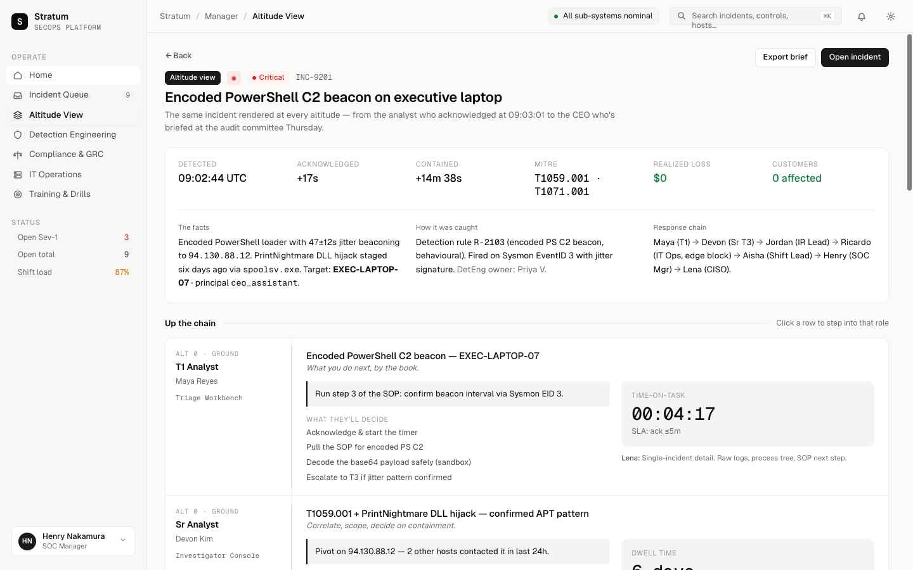

# Stratum SecOps — SOC Interview Simulator

A fully interactive, single-file Security Operations Center platform built for SOC interview preparation and role-based training. No backend, no build step, no install — just open the HTML file in a browser.

---

## What It Is

Stratum SecOps simulates a real enterprise SOC platform across the full organizational hierarchy — from a Tier 1 analyst triaging alerts to a CEO receiving a board briefing. The same incidents, the same data, radically different views depending on which role you step into.

Built to answer one question: **"What does this person actually need to see and decide?"**

---

## Screenshots

| Manager Home | Altitude View | Altitude Deep Dive |
|---|---|---|
|  |  |  |

---

## How to Run

```bash
# Clone the repo, then:
open "SOC-Simulator/Stratum SecOps.html"
# or just double-click the file in your file manager
```

No npm, no webpack, no server required. React 18 and Babel are loaded from CDN with SRI hashes.

---

## The Altitude System

The core concept is **altitude** — where you sit in the org chart determines what information you see, at what granularity, and what actions you're expected to take.

| Altitude | Roles | What They See |
|---|---|---|
| 0 — Ground | T1 Analyst, Sr. Analyst | Individual alerts, assigned queue, playbooks |
| 1 — Lead | Shift Lead, IR Lead, Det Eng Lead, IT Ops Lead | Team queue, escalation paths, detection pipeline |
| 2 — Manager | SOC Manager | KPIs, SLA health, team capacity, executive comms |
| 3 — Director | Director SecOps, GRC Director | Cross-team posture, compliance gaps, board prep |
| 4 — Sr. Director | Sr. Director Cyber Defense | Strategic risk, portfolio view, budget exposure |
| 5 — Executive | CISO, CTO | Enterprise risk, regulatory posture, tech debt |
| 6 — C-Suite | CEO | Business impact, dollar exposure, audit readiness |

The **Altitude View** (signature feature) renders a single incident — INC-9201, a PowerShell C2 beacon on an executive laptop — simultaneously from every altitude so you can see how the narrative changes as it moves up the chain.

---

## Roles Available

Switch roles at any time using the role switcher in the sidebar:

- **Maya Reyes** — Tier 1 SOC Analyst
- **Devon Kim** — Sr. SOC Analyst (T2/T3)
- **Aisha Okafor** — SOC Shift Lead
- **Jordan Tan** — IR / Forensics Lead
- **Priya Venkat** — Detection Engineering Lead
- **Ricardo Bauer** — IT Operations Lead
- **Elena Marsh** — Compliance & GRC Director
- **Henry Nakamura** — SOC Manager
- **Sarah Chen** — Director, Security Ops
- **Marcus Adeyemi** — Sr. Director, Cyber Defense
- **Lena Petrova** — CISO
- **Raj Sundaram** — CTO
- **Victoria Wexler** — CEO

---

## Pages & Features

| Page | Available to | Description |
|---|---|---|
| **Home** | All roles | Role-specific dashboard — queue snapshot, KPIs, or executive brief |
| **Incident Queue** | Altitude 0–4 | Filterable incident list with severity, kind, dept, and search |
| **Incident Detail** | Altitude 0–4 | Full incident view: MITRE ATT&CK, timeline, blast radius, SLA status |
| **Altitude View** | Altitude 2+ | One incident rendered at every level of the org simultaneously |
| **Detection Engineering** | Altitude 1+ | Detection-as-code pipeline, MITRE coverage heatmap, rule health |
| **Compliance & GRC** | Altitude 2+ | Framework controls (SOC 2, PCI-DSS, ISO 27001), gap tracker |
| **IT Operations** | Altitude 1+ | Asset inventory, patch cadence, vulnerability signals |
| **Training & Drills** | Altitude 0–2 | Tabletop scenario library, drill scheduling |
| **Board Reports** | Altitude 3+ | Executive-ready risk summaries and trend reporting |

---

## Signature Incident: INC-9201

The pre-loaded scenario is a **Critical C2 beacon** on an executive laptop:

- **Threat:** Encoded PowerShell loader beaconing to `94.130.88.12` with 47s±12s jitter
- **Entry point:** PrintNightmare DLL hijack via `spoolsv.exe`, staged 6 days prior
- **MITRE:** T1059.001 (PowerShell) · T1071.001 (Web Protocols)
- **CVE:** CVE-2021-34527 (PrintNightmare)
- **Asset:** `EXEC-LAPTOP-07` — CEO assistant account
- **Dollar exposure:** $8.4M
- **Detection source:** EDR — Sysmon EventID 3, confidence 96%

The incident includes a full timeline from the initial SIEM alert through IR engagement, firewall block, and executive notification.

---

## Customization

A tweaks panel (gear icon, bottom-left) lets you adjust:

- **Theme:** Light / Dark
- **Density:** Comfortable / Compact / Dense
- **Brand:** Org name, mark letter, and brand color — so you can reskin it as your own org

---

## File Structure

```
SOC-Simulator/
├── Stratum SecOps.html     # Entry point — open this
├── styles.css              # Full design system (CSS custom properties, themes)
├── tweaks-panel.jsx        # Live customization panel
├── screenshots/            # UI screenshots
├── src/
│   ├── data.js             # All shared data: roles, incidents, detections, controls
│   ├── app.jsx             # Root app + routing + role state
│   ├── shell.jsx           # Sidebar, topbar, role switcher
│   ├── home.jsx            # Role-specific home dashboards (all 7 altitudes)
│   ├── queue.jsx           # Incident queue + incident detail view
│   ├── altitude.jsx        # Altitude View (signature feature)
│   ├── pages.jsx           # Detection, Compliance, IT Ops, Training, Reports
│   ├── primitives.jsx      # Shared UI components (chips, tables, cards)
│   ├── icons.jsx           # Icon set
│   └── legacy/
│       └── SOC_drill_source.tsx   # Original TypeScript prototype
└── uploads/
    └── SOC interview_drill.tsx    # Source upload reference
```

---

## Interview Use Cases

This simulator was designed specifically for SOC interview preparation:

- **"Walk me through how you'd triage this alert"** — step into T1, open INC-9201, work through the timeline
- **"How do you communicate risk to leadership?"** — switch to CISO or Director, view the Altitude View
- **"What metrics would you track as a SOC Manager?"** — switch to SOC Manager, explore the home dashboard and SLA panels
- **"How does your team's work connect to compliance?"** — explore the Compliance & GRC page from multiple altitudes
- **"What does a detection engineering pipeline look like?"** — Detection Engineering page with MITRE coverage heatmap

---

## Tech Stack

- **React 18** (UMD, CDN-loaded, SRI verified)
- **Babel Standalone** (in-browser JSX transpilation)
- **Zero dependencies** beyond the above
- **Zero build step** — edit any `.jsx` file and refresh

---

## License

MIT — use it for training, demos, interview prep, or fork it to build your own org's simulator.
